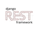

## Olá, eu sou o Pedro👋

Um desenvolvedor Back-end do Recanto Maestro, Rio Grande do Sul

<ul style="list-style: none; padding: 0; margin: 0;">
  <li style="margin-bottom: 1em;">
    💼 Trabalho no projeto TecnoAMF da Antonio Meneghetti Faculdade.
  </li>
   
  <li style="margin-bottom: 1em;">
    🎓 Estudo Sistemas de Informação na Antonio Meneghetti Faculdade.
  </li>
   
  <li style="margin-bottom: 1em;">
    <strong>✉️ Para entrar em contato comigo</strong>   
    
    
    
    
  </li> 

  <li style="margin-bottom: 1em; display: flex; justify-content: space-between;">
    

      <strong>🛠️ Backend</strong> 
      

        
        
        
        
      

    

    
  

    <strong>🛠️ Backend</strong> 
    

      
      
      
      
    

  

  </li>
  

  <li style="margin-bottom: 1em;">
    <strong>📚 Estou aprendendo</strong> 
    

      
      
    

  </li>
</ul>
