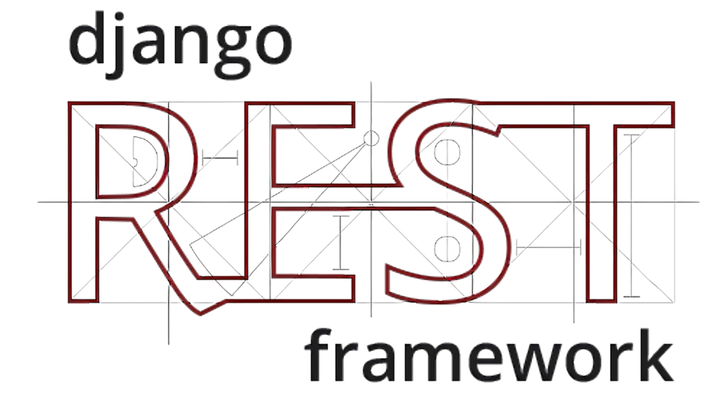

## Olá, eu sou o Pedro👋

Um desenvolvedor Back-end do Recanto Maestro, Rio Grande do Sul

<ul style="list-style: none; padding: 0; margin: 0;">
    
   
  <li style="margin-bottom: 1em;">
    💼 Trabalho no projeto TecnoAMF da Antonio Meneghetti Faculdade.
  </li>
   
  <li style="margin-bottom: 1em;">
    🎓 Estudo Sistemas de Informação na Antonio Meneghetti Faculdade.
  </li>
   
  <li style="margin-bottom: 1em;">
    <strong>✉️ Para entrar em contato comigo</strong>   
    
    
    
    
  </li> 

  <li style="margin-bottom: 1em;"> 
    <strong>🛠️ Tecnologias e Ferramentas</strong> 
    

  
  
  
  
    

  </li>
</ul>
